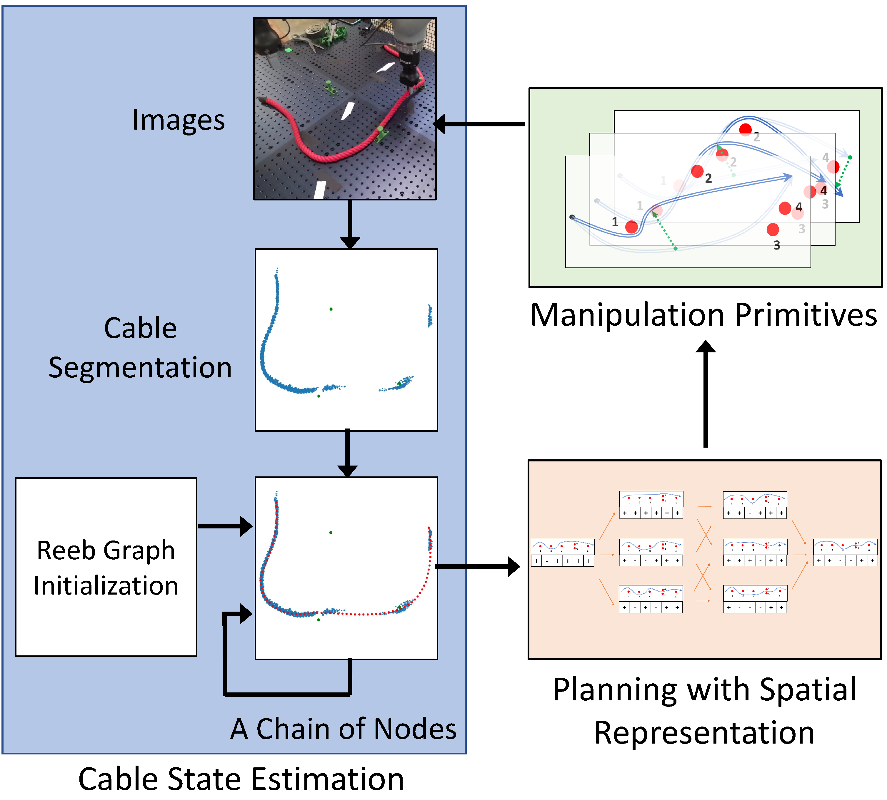

## Robotic Cable Routing with Spatial Representation
Shiyu Jin, Wenzhao Lian, Changhao Wang, Masayoshi Tomizuka, and Stefan Schaal

Intrinsic Innovation LLC, UC Berkeley

### Abstract

Cable routing is a challenging task for robotic automation. To accomplish the task, it requires a high-level path planner to generate a sequence of cable configurations from the initial state to the target state and a low-level manipulation planner to plan the robot motion commands to transit between adjacent states. However, there are yet no proper representations to model the cable with the environment objects, impeding the design of both high-level path planning and low-level manipulation planning. In this paper, we propose a framework for cable routing with spatial representation. For high-level planning, by considering the spatial relations between the cable and the environment objects such as fixtures, the proposed method is able to plan a path from the initial state to the goal state in a graph. For low-level manipulation, multiple manipulation primitives are efficiently learned from human demonstration, to configure the cable to planned intermediate states leveraging the same spatial representation. We also implement a cable state estimator that robustly extracts the spatial representation from raw RGB-D images, thus completing the cable routing framework. We evaluate the proposed framework with various cables and fixture settings, and demonstrate that it outperforms some baselines in terms of reliability and generalizability.

### Proposed Framework

  

The proposed cable routing framework consists of three modules: 1) cable state estimation, 2) planning with spatial representation, and 3) learning manipulation primitives.

### Spatial Representation

  

An example spatial representation. Red dots 1,2,3,6 are single fixtures. Red dots 4 and 5 form a channel fixture. The cable from the fixed end to the loose end is traced following the orange arrows. The green arrows indicate the projection of fixtures onto the cable. The spatial state for each fixture is determined by the sign of the cross product between the green and orange arrows. In this particular example, the spatial representation is (+,-,-,-,+,+). Intuitively, the spatial representation means that the six fixtures are on the (right, left, left, left, right, right) side of the cable.

  

Planning from the initial spatial representation to the goal spatial representation. Intermediate states are generated along each path, where the spatial representation vector changes in one and only one dimension at every step.

### Learning Manipulation Primitives

  

Manipulation primitives: (a) In stretch, a robot stretches the slack cable to establish contact with the fixtures. (b) In cross, a robot transports the cable from one side of the fixture to the other. (c) In insert, a robot inserts the cable between two fixtures of the channel. cross and insert change the spatial state, while stretch does not.

### Segmentation Neural Network

  

The cable segmentation neural network is trained with collected real images on a red rope and data augmentation without human annotation. It can be generalized to cables of different colors.

### Experiments Videos (speed*10)

#### 4 Different Scenarios 

#### Experiments (Scenario 1) with cables of different colors, thickness, and stiffness

#### Failure Cases
Overstretching

   
Slack

